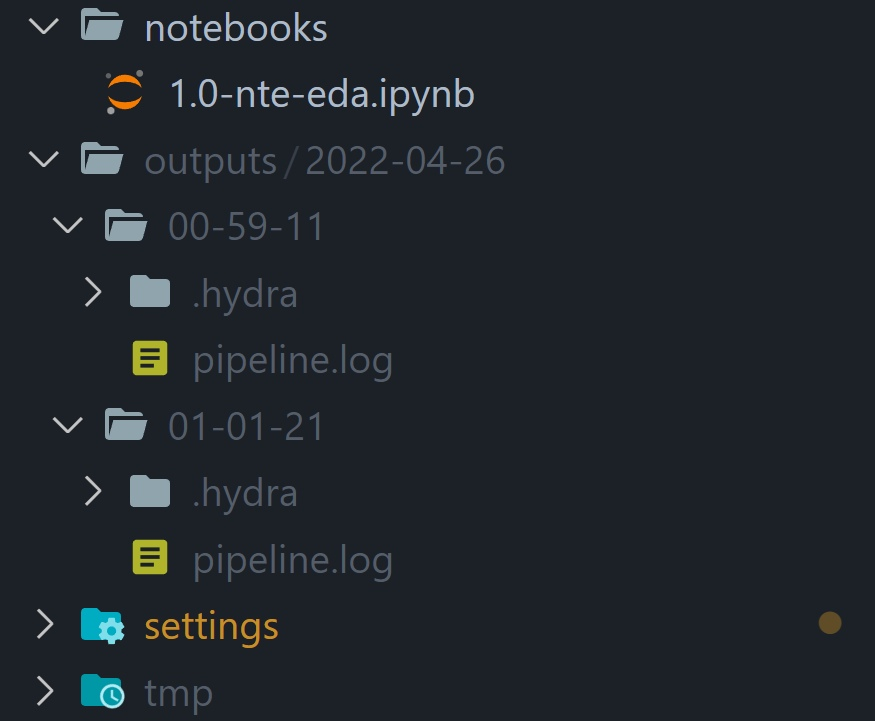

# __Basic usage__

## __Run the training pipeline with hydra__
In directory `ml_project`, run the following command: 

`>>> python3 pipeline.py`

After this, `outputs/` dir should be automatically created by hydra to manage runs.

__Note__: due to relative pathing, the paths convention is `../../../desired-dir-name`.

__Upd__: now `${dir_prefix}` variable can be used to manage relativa pathing in configs.

## __Configure the pipeline!__
With hydra it is really simple and straightforward, just specify the required configuration
throgh the CLI like `estimator=random-forest` or `++random_state=42` (use `++` to override existing values).

## __Logging__
Loggers are used in most modules and the logfile can be found in hydra's `outputs/` directory as `pipeline.log`.
